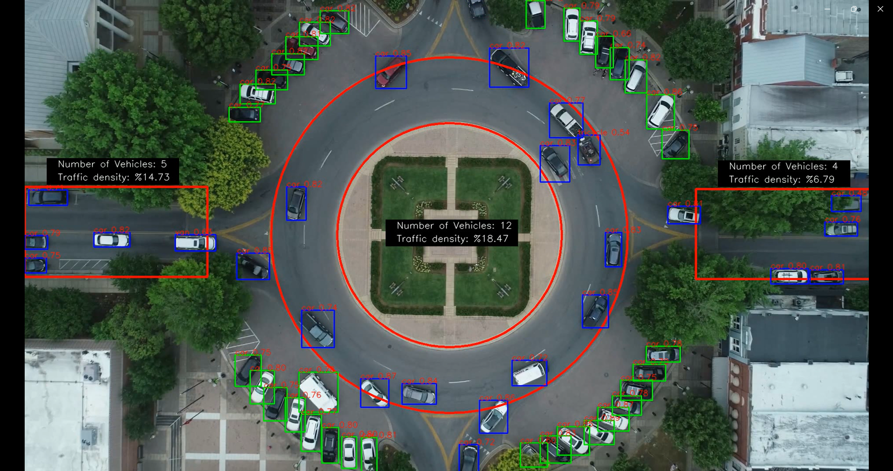

# Traffic-Density-Analysis-with-Computer-Vision
The system I developed takes video footage of a highway as input. It analyzes the number of vehicles, vehicle types, and traffic density on the highway in real-time.

The statistics provided by this system can provide many other benefits besides just measuring traffic density. For example, the hourly rate for electronic billboards on a highway increases during peak traffic hours and decreases during low traffic hours. This way, advertisers save money while advertising agencies maximize their financial profit.


## Installation

Clone the repository:

```bash
git clone https://github.com/hakankocakk/Traffic-Density-Analysis-with-Computer-Vision.git
```
Install dependencies:

```bash
pip install -r requirements.txt
```
Video link:
Download the video and upload it to the videos/test folder
[![Video Title]](https://drive.google.com/file/d/1UHODDpvU2gFCI9337M0tLHw63bzt2r7J/view?usp=sharing)

Project Screenshot:


### **About the Developer**
- Hakan KOCAK

